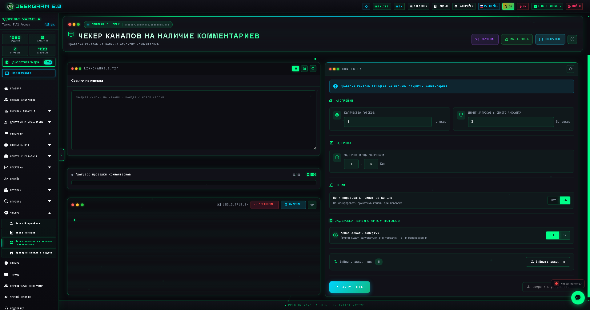
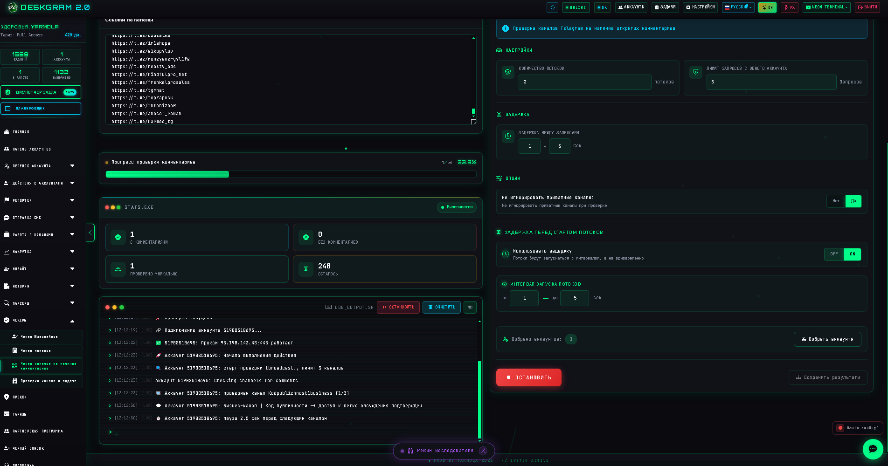
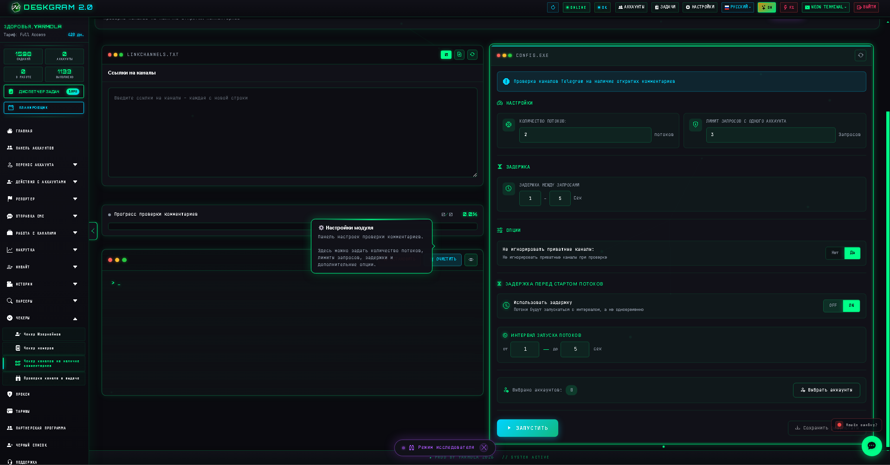
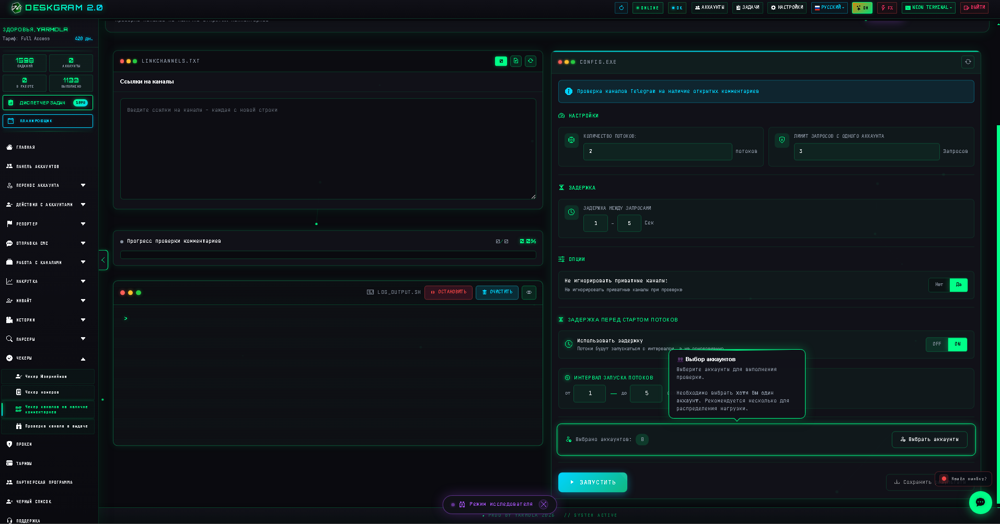

# Чекер каналов на комментарии в Telegram через Deskgram 2

Чекер каналов на комментарии в Deskgram 2 помогает быстро понять, в каких Telegram-каналах открыты комментарии, а в каких нет. Этот модуль полезен, когда нужно собрать площадки с обсуждениями для engagement-сценариев, parser-маршрутов и AI-комментинга, не проверяя каналы вручную один за другим.

[Главный хаб Deskgram 2](https://github.com/Deskgram-2/deskgram-2-telegram-automation) · [Сайт](https://deskgram2.com/) · [Telegram-бот](https://t.me/DG2welcomebot) · [Web preview](https://deskgram2.com/web-preview?path=%2Fapp-demo%2F&lang=ru)

## Интерактивный Web Preview

Попробовать модуль в браузере: [Открыть веб-превью](https://deskgram2.com/web-preview?path=%2Fapp-demo%2Ffunctions%2Fchecker_channels_comments&lang=ru)

Это удобно, если хотите заранее увидеть статистику по каналам с комментариями, настройки потоков и выбор аккаунтов.

## Скриншоты

## Кратко о модуле

| Параметр | Что внутри |
|---|---|
| Основная задача | Проверка, открыты ли комментарии у Telegram-каналов |
| Важные блоки | Список каналов, статистика, лимиты, задержки, выбор аккаунтов |
| Полезен для | AI-комментинга, сбора из комментариев, discovery площадок с обсуждениями |
| Связанные модули | Нейрокомментинг, Сбор из комментариев, Поиск каналов |

## Что умеет модуль

- проверять каналы на наличие комментариев;
- разделять каналы с обсуждениями и без них;
- показывать итоговую статистику по результатам;
- настраивать потоки, лимиты и задержки;
- сохранять результат для следующих сценариев.

## Быстрый старт

1. Загрузите список каналов для проверки.
2. Настройте потоки, лимиты и задержки.
3. Выберите аккаунты.
4. Запустите проверку и дождитесь статистики.
5. Передайте каналы с комментариями в следующий модуль.

## Где этот модуль особенно полезен

- [Нейрокомментинг](https://github.com/Deskgram-2/telegram-neuro-commenting-deskgram), если важно заранее отделить каналы с рабочими обсуждениями;
- [Сбор из комментариев](https://github.com/Deskgram-2/telegram-comment-audience-parser-deskgram), если нужен более теплый список площадок под комментарный parser;
- [Поиск каналов и групп](https://github.com/Deskgram-2/telegram-channel-search-deskgram), если discovery идет в два шага: найти площадки, затем проверить комментарии;
- [Диспетчер задач](https://github.com/Deskgram-2/telegram-task-manager-deskgram), если checker — часть более широкой операционной цепочки.

## Когда особенно полезен

- когда нужен список каналов именно с обсуждениями;
- когда не хочется вручную открывать десятки площадок и проверять комментарии;
- когда comments-first сценарии важнее обычного охвата;
- когда discovery нужно отфильтровать по реальному engagement-слою.

## Что выбрать: чекер каналов на комментарии или поиск каналов

| Если задача такая | Лучше использовать |
|---|---|
| Нужно сначала найти сами площадки | [Поиск каналов и групп](https://github.com/Deskgram-2/telegram-channel-search-deskgram) |
| Нужно отделить каналы, где реально открыты обсуждения | [Чекер каналов на комментарии](https://github.com/Deskgram-2/telegram-channel-comments-checker-deskgram) |
| Нужен двухшаговый discovery для comments-flow | Сначала поиск каналов, потом чекер комментариев |
| Нужны площадки под AI-комментинг и parser комментариев | Чекер комментариев |

## Смежные репозитории

- [Главный хаб Deskgram 2](https://github.com/Deskgram-2/deskgram-2-telegram-automation)
- [Нейрокомментинг](https://github.com/Deskgram-2/telegram-neuro-commenting-deskgram)
- [Сбор из комментариев](https://github.com/Deskgram-2/telegram-comment-audience-parser-deskgram)
- [Поиск каналов и групп](https://github.com/Deskgram-2/telegram-channel-search-deskgram)
- [Диспетчер задач](https://github.com/Deskgram-2/telegram-task-manager-deskgram)

## FAQ

### Можно ли сначала посмотреть интерфейс до запуска?

Да. Веб-превью уже показывает статистический блок, список каналов и параметры проверки.

### Этот модуль нужен только для AI-комментинга?

Нет. Он полезен и для любого parser/discovery-сценария, где важны открытые обсуждения.
